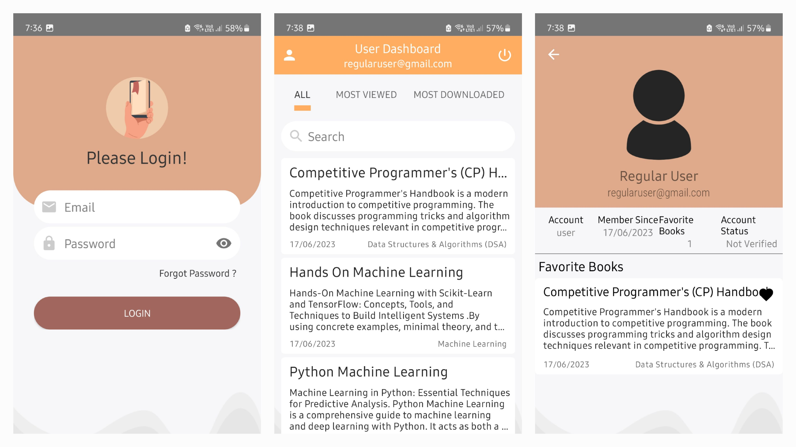
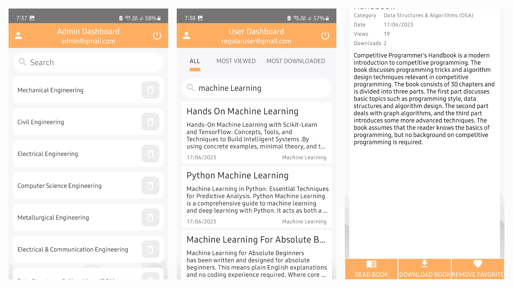

# BookStack Android App

BookStack is an Android app developed using Kotlin and Firebase that caters to the educational needs of the student community within our college. The app follows the MVC architecture, providing a seamless experience for accessing a variety of educational resources, including books, notes, and previous year question papers (PYQs).

## Features

1. **Firebase Integration**
   - Utilizes Firebase as a Backend as a Service (BaaS) solution.
   - Firebase Database for real-time data synchronization.
   - Firebase Authentication for secure user authentication.

2. **PDF Viewing and Download**
   - Implements a feature allowing users to preview PDFs before downloading.
   - Uses Android WebView for efficient PDF viewing.
   - Incorporates a download feature that fetches books from their Google Drive preview URLs after extracting file IDs using Kotlin Regex.

3. **Admin Panel**
   - Efficiently designed admin panel.
   - Grants designated users the authority to manage content by adding categories and books.

4. **Search Functionality**
   - Integrated search features in both admin and user dashboards.
   - Enables users and admins to locate books within the entire collection or within specific categories.

## Screenshots

1. **Login Screen**
   - The login screen where users authenticate themselves.

2. **User Dashboard**
   - The user dashboard displaying available educational resources.

3. **User Profile**
   - User profile with user information and favourites.



4. **Admin Dashboard**
   - The admin dashboard for managing categories and books.

5. **Search Results**
   - The search results displaying relevant books based on user queries.
  
6. **Book Details**
   - The book details page containing book information like description, category, date uploaded, downloads, views with options to view book, download book and add book to favourites.
  


## How to Run

1. Clone the repository.
   ```bash
   git clone https://github.com/gagarinrout/BookStack.git


2. Open the project in Android Studio.
3. Configure Firebase.
4. Add your google-services.json file to the app directory.
5. Run the app on an Android emulator or a physical device.
